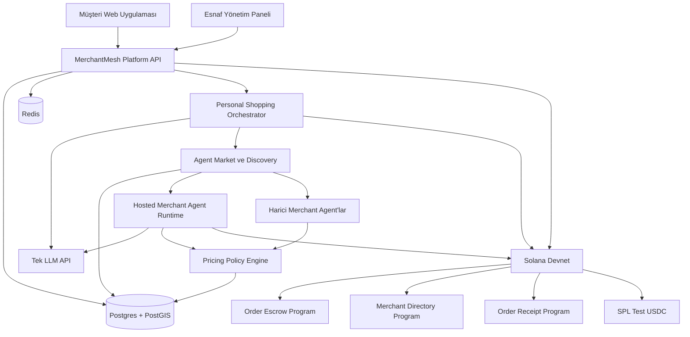

# MerchantMesh — Hedef Son Mimari

## 1. Belgenin amacı

Bu belge MerchantMesh'in Solana dönüşümü ve Agent Market özellikleri tamamlandığında ulaşacağı hedef ürünü tanımlar. Buradaki maddeler mevcut durum açıklaması değil, uygulanacak nihai mimaridir.

Hedef; mock ödeme veya mock zincir kullanmadan, Solana Devnet üzerinde çalışan, kullanıcıların cüzdanla giriş yapabildiği, kendi esnaf agent'larını oluşturabildiği, ürün/fiyat/stok yönetebildiği ve agent'ların tek bir LLM API üzerinden siparişe özel kontrollü teklifler üretebildiği uçtan uca bir pilot üründür.

Devnet sürümünde tokenların ekonomik değeri yoktur; fakat cüzdan imzaları, SPL token transferleri, escrow, release, refund ve receipt işlemleri gerçekten Solana Devnet'e yazılır.

## 2. Ürün özeti

MerchantMesh iki taraflı bir AI alışveriş pazarıdır:

- Müşteri, Phantom/Solflare gibi bir Solana cüzdanıyla giriş yapar.
- Türkçe doğal dilde alışveriş talebi oluşturur.
- Kişisel alışveriş agent'ı talebi canonical SKU'lara dönüştürür.
- Agent Market uygun esnaf agent'larını kategori, konum, sağlık ve performans bilgilerine göre bulur.
- Esnaf agent'ları kendi stok, fiyat ve ticari politikalarını kullanarak siparişe özel teklif üretir.
- Teklifler merchant'ın Ed25519 anahtarıyla imzalanır.
- Kullanıcı bir seçeneği seçer; esnaflar siparişi kabul veya reddeder.
- Bütün esnaflar kabul ettikten sonra kullanıcı kendi cüzdanından Solana escrow hesabını fonlar.
- Teslim kodu doğrulandığında ödeme esnafa bırakılır; zaman aşımı veya geçerli iptal durumunda iade edilir.
- Sipariş sonucu reputation sistemine ve birleşik makbuza işlenir.

## 3. Değişmez kurallar

1. Ana sipariş ödemesi yalnızca merchant onayından sonra fonlanır.
2. Kullanıcının bağlı cüzdanı adına sunucu escrow fonlama imzası atmaz.
3. Bütün para değerleri integer micro-USDC olarak tutulur; float kullanılmaz.
4. LLM nihai fiyat, stok, ödeme tutarı, Solana adresi veya sipariş durumu üretemez.
5. LLM teklif stratejisi ve indirim önerisi üretebilir; nihai rakam policy engine tarafından hesaplanır.
6. Stok ve taban fiyatın doğruluk kaynağı merchant veritabanıdır.
7. Zincire giden her teklif merchant Ed25519 imzasıyla doğrulanır.
8. Her ücretli endpoint idempotency ve payment-proof replay koruması altında kalır.
9. Katalog ve anlık stok Postgres'te; sahiplik, ödeme ve escrow kanıtları Solana'da tutulur.
10. Devnet sürümünde mock chain, mock wallet ve mock payment kullanılmaz.

## 4. Hedef sistem mimarisi



Web uygulamaları tek Platform API ile konuşur. Platform API içeride kimlik, merchant yönetimi, katalog, orchestrator, agent runtime ve Solana modüllerine yönlendirir. Kullanıcının zincir veya servis topolojisini bilmesi gerekmez.

## 5. Kullanıcı rolleri

### 5.1 Müşteri

Müşteri:

- Solana cüzdanıyla giriş yapar.
- Alışveriş talebi oluşturur.
- Agent tekliflerini karşılaştırır.
- Esnaf seçimi yapar.
- Escrow'u kendi cüzdanından fonlar.
- Siparişi takip eder.
- Pickup kodunu esnafa verir.
- Makbuz ve Explorer işlemlerini görür.
- Sipariş sonrası değerlendirme yapar.

### 5.2 Merchant sahibi

Merchant sahibi:

- Solana cüzdanıyla giriş yapar.
- Hosted veya external merchant agent oluşturur.
- İşletme profili ve hizmet alanı tanımlar.
- Ürün, taban fiyat ve stok ekler.
- Minimum fiyat ve indirim politikası belirler.
- Agent stratejisini seçer.
- Agent'ı markette yayınlar.
- Sipariş kabul/red ve hazırlama akışını yönetir.
- Agent kararlarını ve performansını izler.

### 5.3 Platform operatörü

Operatör:

- Merchant doğrulaması yapar.
- Sağlıksız veya kötü niyetli agent'ları askıya alır.
- Dispute süreçlerini inceler.
- Devnet program yapılandırmasını yönetir.
- Rate-limit, audit, ödeme mutabakatı ve sistem sağlığını izler.

## 6. Solana Devnet katmanı

### 6.1 Cüzdan ve giriş

- Wallet Standard destekli Phantom, Solflare ve Backpack bağlantısı kullanılır.
- Backend tek kullanımlık, kısa ömürlü nonce üretir.
- Kullanıcı sabit formatlı giriş mesajını `signMessage` ile imzalar.
- Platform API Ed25519 imzasını public key üzerinden doğrular.
- Başarılı doğrulamadan sonra httpOnly session cookie oluşturulur.
- Solana base58 adresleri küçük harfe çevrilmez; büyük/küçük harf korunur.

### 6.2 SPL token ödemeleri

- Test tokenı 6 decimal SPL mint olarak kullanılır.
- Token miktarları micro-USDC integer/bigint olarak işlenir.
- Gerekli Associated Token Account'lar işlem öncesinde oluşturulur.
- Kullanıcı, merchant ve session wallet'ların işlem ücretleri için Devnet SOL bakiyesi kontrol edilir.
- Ödeme doğrulaması transaction signature üzerinden yapılır.
- Mint, source, destination, authority, amount, commitment ve replay kontrolleri uygulanır.

### 6.3 Anchor programları

#### Order Escrow

- Escrow config PDA
- Merchant wallet kayıtları
- Sipariş escrow PDA'ları
- SPL token vault hesapları
- `fund`
- `mark_preparing`
- `mark_ready`
- `confirm_pickup`
- `refund`
- `user_release`
- `dispute`
- `resolve`

#### Merchant Directory

- Merchant/agent sahipliği
- Agent public key
- Manifest hash
- Aktif/pasif durumu
- İsteğe bağlı stake özeti

#### Order Receipt

- Task ve sipariş sonucu
- Araştırma ödemesi özeti
- Ana ödeme/release/refund kanıtları
- Metadata hash

## 7. Tek LLM API ile çoklu agent modeli

Bütün müşteri ve merchant agent'ları aynı LLM sağlayıcısını ve aynı API anahtarını paylaşabilir. Ayrı agent davranışları ayrı model çalıştırarak değil; agent kimliği, sistem bağlamı, izinli araçlar ve merchant politikalarıyla oluşturulur.

### 7.1 LLM'in görevleri

- Türkçe alışveriş talebini anlamak
- Canonical SKU ve miktar planı üretmek
- Kullanıcının ucuz/yakın/kaliteli tercihlerini çıkarmak
- Merchant siparişini yorumlamak
- Uygun ürün varyantı önermek
- Eksik bilgi varsa açıklama istemek
- İzin verilen aralıkta indirim stratejisi önermek
- Hazırlama süresi ve teklif gerekçesi önermek

### 7.2 LLM'in yapamayacağı işlemler

- Serbest biçimde nihai fiyat belirlemek
- Olmayan stok üretmek
- Solana adresi veya instruction parametresi üretmek
- Escrow tutarı belirlemek
- Sipariş durumunu doğrudan değiştirmek
- Merchant sınırlarını aşan indirim vermek
- Genel SQL veya başka merchant'ın araçlarına erişmek

### 7.3 Merchant izolasyonu

Her tool çağrısında `merchantId` backend tarafından authenticated session/agent context'inden eklenir. LLM'in gönderdiği merchant kimliği kabul edilmez. Böylece bir merchant agent başka merchant'ın ürün, stok, sipariş veya politikasına erişemez.

## 8. Siparişe özel kontrollü fiyatlama

Merchant agent sabit fiyat listesini yalnızca kopyalamaz. Sipariş miktarı, ürün varyantı, teslim alma zamanı, stok seviyesi, kampanyalar ve merchant stratejisini değerlendirerek bir karar önerir.

Nihai fiyat akışı:

```text
Veritabanındaki taban fiyat
× doğrulanmış miktar
+ izin verilen varyant/servis farkı
- aktif kampanya
- LLM'in önerdiği ve politika sınırları içinde kalan indirim
= nihai imzalanabilir teklif
```

### 8.1 Merchant karar şeması

```json
{
  "action": "quote",
  "selectedVariants": [
    {
      "requestedSku": "ground_beef",
      "offeredSku": "ground_beef_low_fat",
      "reason": "Müşteri az yağlı ürün istedi."
    }
  ],
  "proposedDiscountBps": 500,
  "estimatedPrepMinutes": 25,
  "rationale": "Toplu alım ve mağazadan teslim nedeniyle indirim önerildi."
}
```

Bu şemada nihai para tutarı bulunmaz.

### 8.2 Pricing policy

Her merchant/SKU için:

- Taban fiyat
- Minimum fiyat
- Maksimum indirim (`bps`)
- Minimum marj
- Toplu alım kuralları
- Aktif kampanyalar
- Düşük stok davranışı
- Hazırlama kapasitesi
- Pazarlık açık/kapalı durumu
- Agent stratejisi
- Policy version

tutulur.

Policy engine LLM önerisini sınırlar, nihai fiyatı integer matematikle hesaplar ve gerekirse öneriyi reddeder veya izin verilen limite çeker.

### 8.3 Karar kaydı

Her teklif için şunlar kaydedilir:

- Input hash
- Merchant ve agent kimliği
- Model ve prompt/policy version
- LLM kararı
- Uygulanan kurallar
- Taban toplam
- İndirim
- Nihai toplam
- Teklif geçerlilik süresi
- Merchant imzası
- Hata/fallback bilgisi

LLM timeout veya geçersiz çıktı verirse agent, merchant politikasına göre taban fiyatla güvenli teklif verir ya da teklifi reddeder.

## 9. Dinamik merchant agent oluşturma

İlk sürümde hesap başına bir veya daha fazla merchant agent oluşturulabilir. İki runtime tipi desteklenir:

- `hosted`: Agent MerchantMesh altyapısında çalışır.
- `external`: Agent üçüncü taraf endpoint'inde çalışır ve standart manifest/protokol uygular.

### 9.1 Agent oluşturma akışı

1. Merchant Solana cüzdanıyla giriş yapar.
2. İşletme ve agent bilgilerini girer.
3. Kategori ve hizmet alanını tanımlar.
4. Agent stratejisi ve fiyat politikalarını belirler.
5. Ürün, fiyat ve stok ekler.
6. Cüzdan sahiplik mesajını imzalar.
7. Agent health/manifest doğrulamasından geçer.
8. `pending_review` durumuna alınır.
9. Onay sonrası `active` olur ve markette yayınlanır.

### 9.2 Agent durumları

```text
draft → pending_review → active → suspended → archived
```

## 10. Agent manifest standardı

```json
{
  "schemaVersion": "1.0",
  "agentId": "uuid",
  "name": "Ali Kasap Agent",
  "runtime": "hosted",
  "categories": ["butcher"],
  "capabilities": ["quote", "reserve", "order", "pickup"],
  "serviceArea": {
    "latitude": 39.9208,
    "longitude": 32.8541,
    "radiusM": 3000
  },
  "wallet": "SolanaBase58PublicKey",
  "endpoint": "https://agent.example.com",
  "pricingPolicyVersion": "pricing-v1",
  "createdAt": "ISO-8601",
  "signature": "Base58Ed25519Signature"
}
```

Manifest canonical serialization üzerinden imzalanır. Solana Merchant Directory'ye manifestin tamamı yerine hash'i yazılır.

## 11. Tek Platform API

Frontend yalnızca Platform API ile konuşur. Gerekli ana endpoint grupları aşağıdadır.

### 11.1 Auth ve hesap

```http
POST /auth/nonce
POST /auth/verify
POST /auth/logout
GET  /me
PATCH /me/mode
```

### 11.2 Merchant agent yönetimi

```http
POST   /merchant-agents
GET    /merchant-agents/mine
GET    /merchant-agents/:agentId
PATCH  /merchant-agents/:agentId
POST   /merchant-agents/:agentId/publish
POST   /merchant-agents/:agentId/suspend
GET    /merchant-agents/:agentId/decisions
```

### 11.3 Ürün ve stok

```http
POST   /merchant-agents/:agentId/products
GET    /merchant-agents/:agentId/products
PATCH  /merchant-agents/:agentId/products/:productId
DELETE /merchant-agents/:agentId/products/:productId
GET    /merchant-agents/:agentId/inventory
POST   /merchant-agents/:agentId/inventory/adjust
```

Stok doğrudan sessizce ezilmez; hareket olarak kaydedilir:

```text
+ yeni stok
- rezervasyon
+ rezervasyon iptali
- tamamlanan sipariş
± manuel düzeltme
```

### 11.4 Pricing policy

```http
GET   /merchant-agents/:agentId/pricing-policies
PUT   /merchant-agents/:agentId/pricing-policies/:sku
PATCH /merchant-agents/:agentId/strategy
```

### 11.5 Market

```http
GET /market/agents
GET /market/agents/:agentId
GET /market/search
```

Arama parametreleri kategori, konum, yarıçap, online durum, fiyat, yanıt süresi ve reputation filtresi içerebilir.

### 11.6 Siparişler

```http
POST /shopping/tasks
GET  /shopping/tasks/:taskId
POST /shopping/tasks/:taskId/select
POST /shopping/tasks/:taskId/funding-signature

GET  /merchant/orders
POST /merchant/orders/:orderId/accept
POST /merchant/orders/:orderId/reject
POST /merchant/orders/:orderId/preparing
POST /merchant/orders/:orderId/ready
POST /merchant/orders/:orderId/verify-pickup
```

## 12. Veri yerleşimi

| Veri | Sistem |
|---|---|
| Kullanıcı hesabı ve session | Postgres |
| Agent profili ve manifest | Postgres |
| Ürün kataloğu | Postgres |
| Anlık fiyat ve stok | Postgres |
| Stok hareketleri ve rezervasyonlar | Postgres |
| Agent karar logları | Postgres |
| Arama ve konum | Postgres/PostGIS |
| Rate limit, nonce lock, circuit state | Redis |
| Agent/merchant sahipliği | Solana |
| Manifest hash ve aktiflik | Solana |
| SPL araştırma ödemeleri | Solana |
| Escrow fonlama/release/refund | Solana |
| Receipt ve kritik kanıtlar | Solana |

## 13. Agent Market

Market kartında şu bilgiler gösterilir:

- Agent ve işletme adı
- Kategori
- Mesafe ve hizmet alanı
- Online/offline/karantina durumu
- Ortalama yanıt süresi
- Sipariş kabul oranı
- Tamamlama oranı
- Refund/iptal oranı
- Kullanıcı puanı
- Solana kimlik doğrulama rozeti
- Hosted/external runtime bilgisi

Sıralama yalnızca LLM kararıyla yapılmaz. Deterministik skorlama fiyat, mesafe, hazırlama süresi, yanıt süresi, tamamlanma oranı ve kullanıcı tercihlerini kullanır. LLM yalnızca kullanıcının doğal dil tercihlerini ağırlıklara dönüştürebilir.

## 14. Reputation

Reputation aşağıdaki kaynaklardan hesaplanır:

- Teklif yanıt süresi
- İmzalı teklif ile sonuç fiyatının uyumu
- Stok doğruluğu
- Kabul/reddetme oranı
- Zamanında hazırlama
- Tamamlama oranı
- Refund ve iptal oranı
- Dispute sonuçları
- Doğrulanmış müşteri geri bildirimi

Detaylı skor Postgres'te tutulur. Kritik sonuç veya dönemsel özet hash'i Solana'ya yazılabilir. LLM reputation puanı üretmez.

## 15. Stake, slashing ve dispute

İlk Devnet pilotunda:

- Agent isteğe bağlı minimum stake yatırır.
- Stake PDA içinde kilitlenir.
- Otomatik slashing yapılmaz.
- Kötü davranış reputation cezası ve geçici askıya alma ile karşılanır.
- Dispute operatör tarafından incelenir.
- Slashing kararı gecikmeli ve audit log'lu uygulanır.

Tam otomatik slashing ancak kanıt koşulları ve itiraz sistemi kesinleştikten sonra açılır.

## 16. Kötü niyetli veya erişilemeyen agent izolasyonu

- Agent başına rate limit
- İstek başına timeout
- Maksimum response boyutu
- Zod/JSON schema doğrulaması
- İmza, nonce ve timestamp kontrolü
- Idempotency key
- SSRF ve özel IP engeli
- Domain/endpoint doğrulaması
- Circuit breaker
- Artan hata oranında otomatik karantina
- Merchant tenant izolasyonu
- Agent tool allowlist
- Prompt injection'a karşı kullanıcı metnini yalnızca veri olarak işleme
- Health check ve son başarılı yanıt kaydı

## 17. Müşteri deneyimi

Müşteri arayüzü teknik log yerine üç ana aşama gösterir:

```text
İsteğini yaz → Seçeneğini seç → Siparişini takip et
```

Durumlar kullanıcı diline çevrilir:

- İsteğin hazırlanıyor
- Uygun esnaflar bulunuyor
- Esnaflardan fiyat alınıyor
- Teklifler hazır
- Esnaf onayı bekleniyor
- Devnet escrow ödemesi bekleniyor
- Sipariş hazırlanıyor
- Teslime hazır
- Tamamlandı / İade edildi

Teknik ayrıntılar ayrı bir açılır bölümde bulunur:

- Transaction signature
- Explorer bağlantısı
- Merchant public key
- Quote signature/hash
- Program ve PDA adresleri

## 18. Merchant deneyimi

Merchant paneli şu bölümlerden oluşur:

- Genel bakış
- Agent profili
- Ürünler
- Stok hareketleri
- Fiyat politikaları
- Agent stratejisi
- Bekleyen siparişler
- Aktif siparişler
- Tamamlanan/iade edilen siparişler
- Agent karar kayıtları
- Reputation ve sağlık

Her merchant yalnızca kendi agent, ürün, stok, karar ve siparişlerini görebilir.

## 19. Sipariş durum makinesi

```text
quoted
→ user_selected
→ merchant_pending
→ merchant_confirmed
→ awaiting_funding
→ paid_in_escrow
→ preparing
→ ready
→ completed
```

Çıkış durumları:

```text
expired
refunded
cancelled
merchant_rejected
disputed
```

Her geçiş Postgres audit/state log'una yazılır, SSE ile istemciye gönderilir ve zincir işlemi gereken geçişler Devnet transaction signature ile bağlanır.

## 20. Devnet çalışma konfigürasyonu

```env
NEXT_PUBLIC_MOCK=false
MOCK_CHAIN=false
MOCK_PAYMENTS=false
AI_PROVIDER=agy

SOLANA_CLUSTER=devnet
SOLANA_RPC_URL=https://api.devnet.solana.com
NEXT_PUBLIC_SOLANA_CLUSTER=devnet
NEXT_PUBLIC_SOLANA_RPC_URL=https://api.devnet.solana.com

USDC_MINT=<devnet-test-usdc-mint>
NEXT_PUBLIC_USDC_MINT=<devnet-test-usdc-mint>

DATABASE_URL=<postgres-url>
REDIS_URL=<redis-url>
SESSION_WALLET_MASTER_KEY=<secret>
TESTNET_ONLY=true

AGY_BASE_URL=<openai-compatible-api>
AGY_API_KEY=<secret>
AGY_MODEL=<model>
```

Public Devnet RPC geliştirme için kullanılabilir. Paylaşımlı demo veya beta için rate-limit nedeniyle özel RPC tercih edilir.

## 21. Tamamlanma kriterleri

Hedef sürüm ancak aşağıdaki akış mock kullanmadan başarılı olduğunda tamamlanmış sayılır:

1. Yeni kullanıcı Phantom ile bağlanır ve Ed25519 mesaj imzasıyla giriş yapar.
2. Merchant moduna geçip yeni hosted agent oluşturur.
3. Agent'a ürün, fiyat, stok ve fiyat politikası ekler.
4. Agent'ı yayınlar ve market kataloğunda görür.
5. Başka bir müşteri alışveriş talebi oluşturur.
6. Canlı LLM talebi canonical SKU planına dönüştürür.
7. Market yeni agent'ı keşfeder.
8. Merchant agent aynı LLM API ile siparişe özel karar önerir.
9. Policy engine nihai fiyatı hesaplar.
10. Merchant teklifini Ed25519 ile imzalar.
11. Araştırma ücreti gerçek SPL Devnet transferiyle ödenir ve doğrulanır.
12. Merchant siparişi panelden kabul eder.
13. Kullanıcı escrow PDA'sını kendi cüzdanından fonlar.
14. Merchant `preparing` ve `ready` instruction'larını gönderir.
15. Pickup koduyla escrow tokenları merchant'a release edilir.
16. Alternatif senaryoda timeout/refund zincir üstünde gerçekleşir.
17. Receipt oluşturulur ve bütün transaction'lar Solana Explorer Devnet'te görülür.
18. Reputation ve agent karar logları güncellenir.
19. Testler, typecheck ve web production build'i başarıyla geçer.

## 22. Uygulama sırası

### Faz 1 — Solana stabilizasyonu

- TypeScript ve eski EVM test kırıklarını düzelt
- Anchor program testlerini geçir
- Programları Devnet'e deploy/init et
- Test mint, ATA ve Devnet SOL hazırlığını tamamla
- Wallet login, SPL payment ve escrow smoke testlerini geçir

### Faz 2 — Merchant self-service

- Sahiplik kontrollü merchant-agent CRUD
- Ürün ve stok CRUD
- Stok hareketleri
- Fiyat politikaları
- Merchant paneli
- Market publish/unpublish

### Faz 3 — Agent karar ve fiyatlama

- MerchantDecision Zod şeması
- Tek LLM provider
- Merchant context ve izolasyon
- Pricing policy engine
- Karar logları ve fallback
- Teklif endpoint entegrasyonu

### Faz 4 — Agent Market güveni

- Katalog ve arama
- Health check/circuit breaker
- Reputation
- Karantina ve admin doğrulama
- Hosted/external manifest desteği

### Faz 5 — Stake ve dispute

- Stake PDA
- Manuel dispute
- Gecikmeli slashing
- Audit ve itiraz akışı

## 23. Hedef ürün seviyesi

Bu belge tamamlandığında MerchantMesh:

- Mock demo değil, gerçek Solana Devnet pilotu olur.
- Kullanıcıların cüzdanla giriş yaptığı iki taraflı bir ürün olur.
- Merchant'ların kod değiştirmeden agent oluşturabildiği self-service platform olur.
- Tek LLM API ile çok sayıda izole müşteri ve merchant agent çalıştırabilir.
- Siparişe özel, agentic fakat politika kontrollü fiyat üretebilir.
- Araştırma ödemesi, escrow, release, refund ve receipt işlemlerini Solana Devnet üzerinde gerçekleştirir.
- Dinamik agent keşfi, katalog, sağlık ve reputation özelliklerine sahip bir Agent Market MVP'si olur.

Bu seviye kapalı beta, yatırımcı/hackathon demosu ve gerçek kullanıcı pilotu için uygundur. Mainnet öncesinde güvenlik denetimi, özel RPC, operasyonel monitoring, yasal süreçler, gerçek USDC yapılandırması ve kapsamlı yük/güvenlik testleri ayrıca tamamlanmalıdır.
